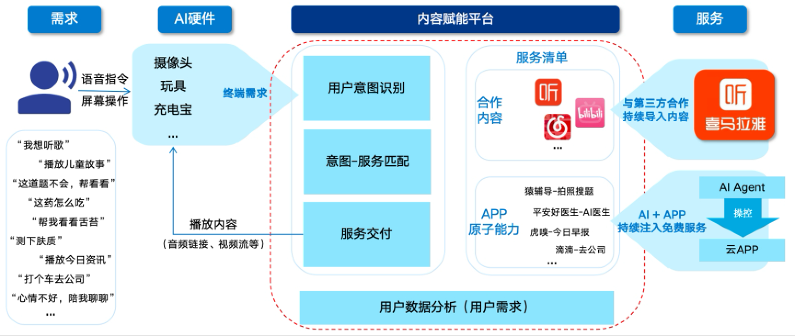

# 速启智能硬件内容赋能平台

**让每一个智能硬件，都能一句话直达云端内容与AI服务。**

为玩具、摄像头、充电宝等各种智能终端，提供丰富的内容、服务，包括喜马拉雅、网易云音乐等。让用户一句话就能得到想要的服务。

支持 Linux / RTOS 多系统环境，3 天极速接入。

## 产品概述

速启提供的面向智能硬件厂商的内容赋能平台，通过应用云化技术与应用自动化操控技术，为智能硬件提供官方授权的音视频内容，以及第三方APP的服务，实现“用户指令直达服务结果”。

都有服务及内容均在云端运行和提供，不占用硬件本地性能及存储。可适用于超低配置硬件。

适用于各年龄用户的语音互动场景，用户可以在居家/移动场景，可以在任何硬件上快速获取需要的内容和服务，覆盖娱乐、陪伴、社交、医疗、打车等互动场景。

 

## 应用场景

- 音频娱乐：提供音乐、有声书内容的播放
- 资讯服务：依托第三方应用，为用户提供早报等定制资讯服务
- 医疗服务：依托第三方应用，为用户提供在线问诊等服务
- 陪伴聊天：依托第三方应用，为用户提供更专业、更情绪的虚拟人陪伴功能
- 在线教育：依托第三方应用，为用户提供拍照解题、AI外教沟通等教育服务
- 车载娱乐：面向车内大屏硬件，提供娱乐、导航、游戏等服务

### 产品优势

- 便捷获取内容/服务：用户无需操作，只需发出指令，即可获取内容，平台会自动识别用户意图，并匹配所需内容/服务
- 云端服务，不占性能：服务及内容均运行在云端，对第三方app的操控也在云端运行，不占用硬件本地的性能与空间
- 大量音视频内容：已有10w+ 首音乐（网易云音乐）、3w+ 听书专辑（喜马拉雅），并在持续扩充
- 官方授权，放心推广：所有音视频内容均为官方授权，可放心推广
- 应用自动化服务，支持按需定制：在云端运行app，并可自动操控应用，如美团、滴滴、平安好医生、猿辅导等；且支持由硬件方或伙伴协助定制自动化场景
- 快速接入：接入简单，最快3天即可完成

## 速启智能终端内容套餐包
包含网易云音乐和喜马拉雅，汽水音乐等内容
详细内容套餐介绍网页：
https://suqi.tech/#/music

## 速启智能终端协议规范
[速启智能终端协议规范文档](https://github.com/sqtech-ai/sqtech-ai-iot/tree/main/docs/速启智能终端协议规范_v1.0.2.md)

## 接入说明

三步完成接入：

Step 1. 申请授权：在 suqi.tech 注册开发者账户，获取 LicenseId 与 Key。

Step 2. 发送请求：设备通过语音或文本下发指令（含授权参数）。

Step 3. 接收结果：平台解析用户意图，调用云APP执行任务，并返回可播放内容。

## 联系我们

商务合作与SDK获取请联系：

[service@suqi.tech](mailto:service@suqi.tech)

18102203284
 