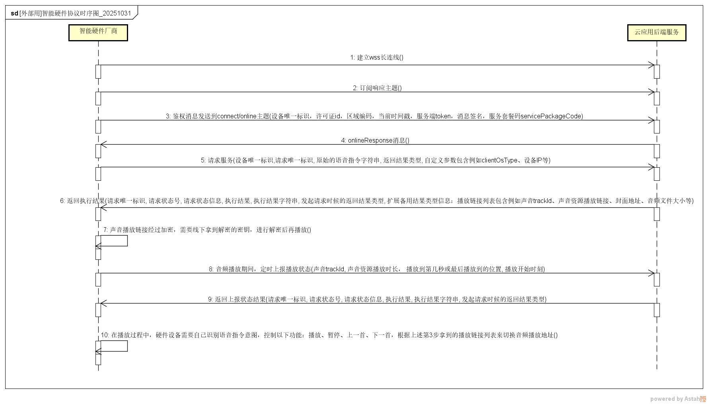

# \[Github\]面向智能终端的协议规范

- [修订记录]("%20\l%20"id-[Github]面向智能终端的协议规范-修订记录)
- [概要]("%20\l%20"id-[Github]面向智能终端的协议规范-概要)
- [1.连接与鉴权]("%20\l%20"id-[Github]面向智能终端的协议规范-1.连接与鉴权)
    - [1.1 环境地址信息：]("%20\l%20"id-[Github]面向智能终端的协议规范-1.1环境地址信息：)
    - [1.2 协议要求：]("%20\l%20"id-[Github]面向智能终端的协议规范-1.2协议要求：)
- [2.协议定义]("%20\l%20"id-[Github]面向智能终端的协议规范-2.协议定义)
    - [2.1 认证授权请求格式定义]("%20\l%20"id-[Github]面向智能终端的协议规范-2.1认证授权请求格式定义)
        - [2.1.1 发送主题：connect/online]("%20\l%20"id-[Github]面向智能终端的协议规范-2.1.1发送主题：connect/online)
        - [2.1.2 认证授权请求的响应主题：response/${app_license_id}/${device_id}]("%20\l%20"id-[Github]面向智能终端的协议规范-2.1.2认证授权请求的响应主题：response/${app_license_id}/${device_id})
        - [2.1.3 鉴权：]("%20\l%20"id-[Github]面向智能终端的协议规范-2.1.3鉴权：)
    - [2.2 请求格式定义]("%20\l%20"id-[Github]面向智能终端的协议规范-2.2请求格式定义)
    - [2.3 响应格式定义]("%20\l%20"id-[Github]面向智能终端的协议规范-2.3响应格式定义)
    - [2.4 后台主动推送通知到智能硬件设备（非必须）]("%20\l%20"id-[Github]面向智能终端的协议规范-2.4后台主动推送通知到智能硬件设备（非必须）)
- [3. 错误码表格]("%20\l%20"id-[Github]面向智能终端的协议规范-3.错误码表格)
- [4.语种类型表格]("%20\l%20"id-[Github]面向智能终端的协议规范-4.语种类型表格)    
- [5.标签列表]("%20\l%20"id-[Github]面向智能终端的协议规范-5.标签列表)

# 修订记录

|     |     |     |     |     |
| --- | --- | --- | --- | --- |
| 日期  | 版本号 | 修订描述 | 修订人 | 备注  |
| 2025-09-03 | v1.0.0 | 初次编写 | zw  | 无   |
| &nbsp;2025-09-30 | &nbsp;v1.0.1 | 2.1.2 认证授权请求的响应主题 onlineResponse  2.2 增加playAudio相关参数positionIndex、pageSize、position、intent、content、musicOption、isRecommend  musicOption对象说明；  2.2.1 示例代码更新  2.3 响应内容，增加onlineResponse以及playAudio相关参数  2.3.1 更新返回结果示例  4.语种类型表格   5.标签列表 | zw  | &nbsp; |
| 2025-10-31 | v1.0.2 | 1.更新时序图：增加关于订阅响应主题、接收onlineResponse消息 | zw  | 无   |

# 概要

本协议基于Websocket传输协议
 

# 1.连接与鉴权

## 1.1 环境地址信息：

域名地址 **device.ai.suqi.tech** ：

缺省端口为443

&nbsp;

通过分配的用户名和密码建立wss连接

	wss://device.ai.suqi.tech/api/v1/mcp

&nbsp;       

## 1.2 协议要求：

使用MQTT协议

注意：入参clientId 对于不同的客户端需要保证唯一，可以用硬件设备的唯一标识id（不能多个连接共用同一个clientId ，可能导致重复id的连接连接失败）

	示例 dummy code：
	client = mqtt.connect("wss://device.ai.suqi.tech/api/v1/mcp", {
		username: USERNAME,
		password: PASSWORD,
		clientId: deviceId, //可以用硬件设备的唯一标识id作为clientId
	});

建立链接后需要订阅主题：/response/${app_license_id}/${device_id} 来接收消息。

其中 ${app_license_id} 赋值为许可证id，${device_id} 赋值为当前设备的唯一id。

# 2.协议定义

协议定义为json格式

## 2.1 认证授权请求格式定义

### 2.1.1 发送主题：connect/online

| **字段** | **说明** | **格式** | **层级** | **是否必填** | **备注** |
| --- | --- | --- | --- | --- | --- |
| deviceId | 设备唯一标识 | string | 1   | 是   | &nbsp; |
| appLicenseId | 许可证id | string | 1   | 是   | 许可证id |
| regionCode | 区域编码 | string | 1   | 是   | 示例：cn-hangzhou |
| appTime | 当前时间戳 | string | 1   | 是   | 当前时间戳 |
| serverToken | 服务端token | string | 1   | 是   | 服务端token |
| sign | 消息签名 | string | 1   | 是   | 消息签名(参考2.1.3节的签名方式) |
| servicePackageCode | 服务套餐码 | string | 1   | 是   | 服务套餐码 |

    {
        "appLicenseId": "1943647177964270250",
        "regionCode": "cn-hangzhou",
        "sign": "73ac8290cf171d296431e09ba017def66c54caaa09ec9a18536e1b8e3ed0b17c",
        "appTime": "1752517930217",
        "deviceId": "30:ed:a0:20:3b:74",
        "serverToken": "bed56257bb5745bf9270fc0e763b396f",
        "servicePackageCode":"xxxxxx"
    }

### 2.1.2 认证授权请求的响应主题：response/${app_license_id}/${device_id}

(请收到这个订阅主题回调通知action:onlineResponse消息，响应成功（code=1000）再进行后续消息的发送)

具体响应消息参考本文档章节2.3

    {
        "code": 1000,
        "message": "Success",
        "result": {
            "id": "a3273f8ee3db11e7bf2ff3223ff33639",
            "text": "执行成功。",
            "action": "onlineResponse",
            "resultType": \["extendParam"\],
            "extendParam": {"deviceId":"xxx"}
        }
    }

### 2.1.3 鉴权：

当前只支持 serverToken  加sign的鉴权方式。

注：appLicenseId、serverToken 和 appKey 由平台分配，通过控制台创建应用获得。

如下面示例：

&nbsp;

\# 以下为鉴权相关的参数

appLicenseId:  1946092004405172632

appTime:  1751628493537

deviceId: XXXXXXXXXXX,

servicePackageCode：code1

sign: f010298578d2671528a2bd6cf101173b9be6c75d3c23a9cf74ec2f36f50e32bc

serverToken: 58372437d6574b66aa7ccec508f0d456

&nbsp;

参数说明  
1.服务端固定分配serverToken、appLicenseId 、servicePackageCode和 appKey。appLicenseId 和 appKey；serverToken在建立链接和随后的请求都需要携带。

2.sign 加密方式：

2.1.服务端需配置对应的一组appLicenseId 和 appKey。  
2.2.服务端使用【 appTime + appLicenseId+ deviceId+servicePackageCode+ appKey 】进行字符串拼接 ，把字符串进行hmac-sha256加密，加密用的key是【appKey】，最后得到【sign】值。

示例：

    appTime: 1718608001524  
    appLicenseId: 1798920654854897665  
    appKey: 816d39dae0344f72845cbad32867dc40  
    加密前的值：17186080015241798920654854897665XXXXXXXXXXXcode116d39dae0344f72845cbad32867dc40    

    {
        "appLicenseId" :  "1943647177964270250" ,
        "regionCode" :  "cn-hangzhou" ,
        "sign" :  "73ac8290cf171d296431e09ba017def66c54caaa09ec9a18536e1b8e3ed0b17c" ,
        "appTime" :  "1752517930217" ,
        "deviceId" :  "30:ed:a0:20:3b:74" ,
        "serverToken" :  "bed56257bb5745bf9270fc0e763b396f" ,
        "servicePackageCode" : "xxxxxx"
    }

&nbsp;

## 2.2 请求格式定义

发送主题：request/${app_license_id}/${device_id}

| **字段** | **说明** | **格式** | **层级** | **是否必填** | **备注** |
| --- | --- | --- | --- | --- | --- |
| deviceId | 设备唯一标识 | string | 1   | 是   | &nbsp; |
| request | 请求相关配置 | object | 1   | 是   | &nbsp; |
| id  | 请求标识 | string | 2   | 是   | 每个请求唯一标识，建议使用全局唯一ID生成方式。 |
| text | 原始的语音指令字符串 | string | 2   | &nbsp; | 硬件设备语音转成文字的原始指令字符串 |
| launchApp | 启动应用名称 | string | 2   | &nbsp; | 备注：如果应用名称没有赋值，则依赖于语音指令字符串text在AI agent的解析与执行 |
| launchTime | 用户想开始这个操作的时间 | string | 2   | &nbsp; | 自然时间描述，示例：2025年8月5日8点 |
| action | 经过意图分析后的执行什么操作 | string | 2   | &nbsp; | 示例：orderMembership，playAudio, reportPlayStatus, 启动应用 等 |
| resultType | 返回结果类型 | array | 2   | 是   | screenshotUrl：截图下载URL  audioPlayUrl：音频播放URL  rtmpUrl：RTMP播放URL  extendParam：扩展备用结果类型信息 |
| agentIndexArray | 要呼起的AI agent 索引号集合 | array | 2   | &nbsp; | 示例："agentIndexArray":\[ "1", "2", "3" \] |
| params | 自定义参数, 用于扩展用途 | &nbsp; | 2   | &nbsp; | 示例："params": {"参数名": "值"}  \["值 1", "值 2"\],  // 对象或数组, 例如可以传用户账号信息  mobile用于鉴权 |

可选的params参数：

| **生效的action操作** | **字段** | **说明** | **类型** | **层级** | **是否必须** |
| --- | --- | --- | --- | --- | --- |
| playAudio | positionIndex | 位点，除第1页之外，都需要传递；前端原样返回。  用法：本参数把第一页调用的返回值position_index，  做为第2页的入参即可。同样，第2页的position_index返回值，  做为第3页的入参。 | string | 3   | 否   |
| |pageSize | 页大小，默认10，1~20 | int | 3   | 否   |
| |position | 集数，用户要求具体播放的集数，从1开始，这里需要注意目前只有声书才有集数，  音乐类型没有 | int | 3   | 否   |
| |intent | 意图，listen_audiobook：有声书，listen_music：音乐 | string | 3   | 否   |
| |content | 搜索内容 | string | 3   | 否   |
| |musicOption | intent为”listen_music”时,允许通过此条件进行多维度搜索,具体字段见下面musicOption说明,传了此字段则会忽略content | Object | 3   | 否   |
| |isRecommend | 未搜索到结果时,是否返回推荐歌单,  默认 false-不返回;  true-返回推荐 | boolean | 3   | 否   |

&nbsp;

musicOption对象

|     |     |     |     |     |     |
| --- | --- | --- | --- | --- | --- |
| **字段** | **说明** | **格式** | **层级** | **是否必填** | **备注** |
| artistName | 歌手名 | string | 4   | 否   | &nbsp; |
| songName | 歌曲名 | string | 4   | 否   | &nbsp; |
| language | 语种,枚举见附录&lt;语种类型&gt; | string | 4   | 否   | &nbsp; |
| albumName | 专辑名 | string | 4   | 否   | &nbsp; |
| artistSex | 艺人性别: 男/女/组合 | string | 4   | 否   | &nbsp; |
| isOriginal | 是否原唱: true-原唱;false-非原唱 | boolean | 4   | 否   | &nbsp; |
| area | 艺人区域: 内地/香港/台湾/日韩/欧美 | string | 4   | 否   | &nbsp; |
| tag | 标签,枚举见附录&lt;标签列表&gt;,后续会陆续补充 | string | 4   | 否   | &nbsp; |

&nbsp;

&nbsp;

示例2.2.1：请求发送消息包含了语音指令字符串、硬件设备信息，用于请求播放云端音频服务

示例：listen_audiobook

    {
        "deviceId": "uid388808088185088",
        "request": {
            "id": "a3273f8ee3db11e7bf2ff3223ff33638",
            "text": "我想听西游记故事",
            "launchApp": "喜马拉雅", //备注：如果应用名称没有赋值，则依赖于语音指令字符串text在AI agent的解析与执行
            "action": "playAudio",
            "resultType": \["extendParam"\], //extendParam可以用于备用扩展结果类型，例如播放链接列表数组；
            "params":{"deviceIp":"xxxxxx","positionIndex":2,"pageSize":15,"intent":"listen_audiobook","content":"西游记","position":1,"isRecommend":true} //deviceIp（非必传）:设备IP
        }
    }

示例：listen_music

    {
        "deviceId": "uid388808088185088",
        "request": {
            "id": "a3273f8ee3db11e7bf2ff3223ff33638",            "text": "播放向云端",
            "launchApp": "网易云音乐", //备注：如果应用名称没有赋值，则依赖于语音指令字符串text在AI agent的解析与执行
            "action": "playAudio",
            "resultType": \["extendParam"\], //extendParam可以用于备用扩展结果类型，例如播放链接列表数组；
            "params":{
            	"deviceIp":"xxxxxx","positionIndex":2,"pageSize":15,"intent":"listen_music","content":"播放向云端","position":1,"isRecommend":true,
                "musicOption":{"artistName":"黄绮珊","songName":"向云端","language":"国语","albumName":"","artistSex":"女","isOriginal":true,"area":"中国","tag":"KTV"}
        	} //deviceIp（非必传）:设备IP，
        }
    }

&nbsp;

示例2.2.2：音频播放期间，定时利用params参数上报云端应用需要的trackId、duration、played_secs、started_at 信息, "action"传"reportPlayStatus" 

    {
        "deviceId": "uid388808088185088",
        "request": {
            "id": "a3273f8ee3db11e7bf2ff3223ff33639",
            "text": "定时回传播放情况",
            "launchApp": "喜马拉雅", //备注：如果应用名称没有赋值，则依赖于语音指令字符串text在AI agent的解析与执行
            "action": "reportPlayStatus",
            "resultType": \["extendParam"\],
            "params":\[{"trackId":"xxxxx", "duration":xxxxx, "played_secs":xxxxx, "started_at":xxxx}\]//回传策略：建议频率为分钟级别或者满100条的时候进行回传
        }
    }

## 2.3 响应格式定义

订阅主题：response/${app_license_id}/${device_id}

| **字段** | **说明** | **格式** | **层级** | **是否必填** | **备注** |
| --- | --- | --- | --- | --- | --- |
| code | 请求状态号 | int | 1   | 是   | 详情请参考本文档第三节 错误码表格 。 |
| message | 请求状态信息 | string | 1   | 是   | inProgress / success / fail |
| result | 执行结果 | object | 1   | 是   | &nbsp; |
| id  | 请求标识 | string | 2   | 是   | 请求中的 id。 |
| text | 执行结果字符串 | string | 2   | 是   | 执行结果字符串，硬件设备按需处理，如用语音播放字符串，或显示在屏幕 |
| action | &nbsp;发起请求时候的执行什么操作 | string | 2   | &nbsp; | 示例：启动应用，播放童话故事 等 |
| resultType | &nbsp;发起请求时候的返回结果类型 | array | 2   | 是   | screenshotUrl：截图下载URL  audioPlayUrl：音频播放URL  rtmpUrl：RTMP播放URL  extendParam：扩展备用结果类型信息 |
| screenshotUrl | 截图下载地址 | string | 2   | &nbsp; | 截图下载地址 |
| audioPlayUrl | 声音资源播放链接 | string | 2   | &nbsp; | 声音资源播放链接，根据具体服务场景而定，有些服务会传加密后的链接，  则需要在硬件设备做解密才能播放，密钥线下联系提供 |
| rtmpUrl | 音视频资源RTMP播放链接 | string | 2   | &nbsp; | 音视频资源RTMP播放链接，根据具体服务场景而定，有些服务会传加密后的链接，  则需要在硬件设备做解密才能播放，密钥线下联系提供 |
| extendParam | 扩展备用结果类型信息 | &nbsp; | 2   | &nbsp; | &nbsp; |

extendParam 信息说明

| **生效的action操作** | **字段** | **说明** | **类型** | **层级** | **是否必须** |
| --- | --- | --- | --- | --- | --- |
| onlineResponse | deviceId | 上线成功的设备id | string | 3   | &nbsp; |
| playAudio         | trackId | 声音Id | string | 3   | &nbsp; |
| |coverUrl | 封面图片地址 | string | 3   | &nbsp; |
| |playUrl | 音频播放地址，加密 | string | 3   | &nbsp; |
| |playSize | 音频文件大小，单位字节 | string | 3   | &nbsp; |
| |duration | 声音时长，单位秒 | string | 3   | &nbsp; |
| |positionIndex | 位点字段，由调用方原样传递 | string | 3   | &nbsp; |
| |hasNext | 是否还有下一页，请根据该字段判断是否有下一页，不能通过数据条数判断 | boolean | 3   | &nbsp; |
| |title | 声音标题 | string | 3   | &nbsp; |
| |albumName | 专辑名 | string | 3   | &nbsp; |
| |artists | 艺人名,多个用逗号隔开 | string | 3   | &nbsp; |

  
示例2.3.1：返回执行结果（包含执行结果字符串、加密后的音频播放链接要在硬件设备解密, 专辑封面图片url）

    {

    "code": 1000,

    "message": "Success",

    "result": {

    "id": "a3273f8ee3db11e7bf2ff3223ff33638",

    "text": "执行成功。",

    "action": "playAudio",

    "resultType": \["extendParam"\],

    "extendParam": \[{ //播放链接列表数组

        "trackId": "45981885",

        "coverUrl": "http://xxxx/1.jpg",

        "playUrl": "fwpomVabHKxPjSL4iTmzNJHVnlUd8+7Uf6MEZuABd3+GSu1DOiSLBRTpscbFjtogb1Hcg2g2l5v4uS",//加密后的音频播放链接要在硬件设备解密

        "playSize": "18397033",

        "duration": "2299",

        "positionIndex":"1111",

        "hasNext":true,

        "title": "向云端（伴奏）",

        "albumName": "向云端",

        "artists": "小霞,海洋Bo"

        },

        {

        "trackId": "45981886",

        "coverUrl": "http://xxxx/2.jpg",

        "playUrl": "fwpomVabHKxPjSL4iTmzNJHVnlUd8+7Uf6MEZuABd3+GSu1DOiSLBRTpscbFjtogb1Hcg2g2l5weQX",//加密后的音频播放链接要在硬件设备解密

        "playSize": "28397033",

        "duration": "3299",

        "positionIndex":"1111",

        "hasNext":true,

        "title": "向云端（伴奏）",

        "albumName": "向云端",

        "artists": "小霞,海洋Bo"

    },

    {

        "trackId": "45981887",

        "coverUrl": "http://xxxx/3.jpg",

        "playUrl": "fwpomVabHKxPjSL4iTmzNJHVnlUd8+7Uf6MEZuABd3+GSu1DOiSLBRTpscbFjtogb1Hcg2g2l55WX8",//加密后的音频播放链接要在硬件设备解密

        "playSize": "28397044",

        "duration": "2599",

        "positionIndex":"1111",

        "hasNext":true,

        "title": "向云端（伴奏）",

        "albumName": "向云端",

        "artists": "小霞,海洋Bo"

        }\]

    }

    }

示例2.3.2：返回关于定时上报播放情况的结果

    {

        "code": 1000,

        "message": "Success",

        "result": {

        "id": "a3273f8ee3db11e7bf2ff3223ff33639",

        "text": "执行成功。",

        "action": "reportPlayStatus",

        "resultType": \["extendParam"\],

        "extendParam": {"result":"reportSuccess"}

    }

    }

&nbsp;

## 2.4 后台主动推送通知到智能硬件设备（非必须）

| **字段** | **说明** | **格式** | **层级** | **是否必填** | **备注** |
| --- | --- | --- | --- | --- | --- |
| notificationId | 通知消息的id标识 | string | 1   | 是   | &nbsp; |
| deviceId | 设备唯一标识 | string | 1   | 是   | &nbsp; |
| params | 推送通知消息体内容，自定义用于扩展 | string | 1   | 是   | 示例："params": {"参数名": "值"}  \["值 1", "值 2"\],  // 对象或数组 |

示例：

    {

        "notificationId": "0ce870af-c0f0-4208-aae7-bd7cdf063567",

        "deviceId":"xxxxx",

        "params": {"参数名": "值"}

    }

# 3\. 错误码表格

| **错误码** | **含义** | **说明** |
| --- | --- | --- |
| 1000 | 成功  | &nbsp; |
| 1001 | 请求参数无效 | 请求参数缺失必需字段 / 字段值无效 / 重复请求。 |
| 1002 | 无访问权限 | token 无效 / 过期 / 无权访问指定服务。 |
| 1003 | 访问超频 | 当前 appid 访问 QPS 超出设定阈值。 |
| 1004 | 访问超额 | 当前 appid 访问次数超出限制。 |
| 1005 | 服务器繁忙 | 服务过载，无法处理当前请求。 |
| 1022 | 执行错误 | 执行过程中发生错误。 |
| 1023 - 1098 | 保留号段 | 待定。 |
| 1099 | 未知错误 | 未归类错误。 |

# 4.语种类型表格

&nbsp;

|     |     |
| --- | --- |
| **参数值** | **含义** |
| 国语  | 国语  |
| 粤语  | 粤语  |
| 闽南语 | 闽南语 |
| 英语  | 英语  |
| 日语  | 日语  |
| 韩语  | 韩语  |
| 德语  | 德语  |
| 法语  | 法语  |
| 西班牙语 | 西班牙语 |
| 葡萄牙语 | 葡萄牙语 |
| 意大利语 | 意大利语 |
| 印地语 | 印地语 |
| 俄语  | 俄语  |
| 泰语  | 泰语  |
| 维吾尔语 | 维吾尔语 |
| 藏语  | 藏语  |
| 纯音乐 | 纯音乐 |
| 华语  | 华语  |
| 其他  | 其他  |
| 未知  | 未知  |
| 阿布哈兹语 | 阿布哈兹语 |
| 阿法尔语 | 阿法尔语 |
| 南非语 | 南非语 |
| 阿坎语 | 阿坎语 |
| 阿尔巴尼亚语 | 阿尔巴尼亚语 |
| 阿姆哈拉语 | 阿姆哈拉语 |
| 阿拉伯语 | 阿拉伯语 |
| 阿拉贡语 | 阿拉贡语 |
| 亚美尼亚语 | 亚美尼亚语 |
| 阿萨姆语 | 阿萨姆语 |
| 阿瓦尔语 | 阿瓦尔语 |
| 阿维斯陀语 | 阿维斯陀语 |
| 艾马拉语 | 艾马拉语 |
| 阿塞拜疆语 | 阿塞拜疆语 |
| 班巴拉语 | 班巴拉语 |
| 巴什基尔语 | 巴什基尔语 |
| 巴斯克语 | 巴斯克语 |
| 白俄罗斯语 | 白俄罗斯语 |
| 孟加拉国语 | 孟加拉国语 |
| 比哈尔语 | 比哈尔语 |
| 比斯拉马语 | 比斯拉马语 |
| 波斯尼亚语 | 波斯尼亚语 |
| 布列塔尼语 | 布列塔尼语 |
| 保加利亚语 | 保加利亚语 |
| 缅甸语 | 缅甸语 |
| 加泰隆语 | 加泰隆语 |
| 查莫罗语 | 查莫罗语 |
| 车臣语 | 车臣语 |
| 尼扬贾语 | 尼扬贾语 |
| 楚瓦什语 | 楚瓦什语 |
| 康沃尔语 | 康沃尔语 |
| 科西嘉语 | 科西嘉语 |
| 克里语 | 克里语 |
| 克罗地亚语 | 克罗地亚语 |
| 捷克语 | 捷克语 |
| 丹麦语 | 丹麦语 |
| 迪维希语 | 迪维希语 |
| 荷兰语 | 荷兰语 |
| 不丹语 | 不丹语 |
| 世界语 | 世界语 |
| 爱沙尼亚语 | 爱沙尼亚语 |
| 埃维语 | 埃维语 |
| 法罗语 | 法罗语 |
| 斐济语 | 斐济语 |
| 芬兰语 | 芬兰语 |
| 富拉语 | 富拉语 |
| 加利西亚语 | 加利西亚语 |
| 格鲁吉亚语 | 格鲁吉亚语 |
| 现代希腊语 | 现代希腊语 |
| 瓜拉尼语 | 瓜拉尼语 |
| 古吉拉特语 | 古吉拉特语 |
| 海地克里奥尔语 | 海地克里奥尔语 |
| 豪萨语 | 豪萨语 |
| 希伯来语 | 希伯来语 |
| 赫雷罗语 | 赫雷罗语 |
| 希里莫图语 | 希里莫图语 |
| 匈牙利语 | 匈牙利语 |
| 国际语A | 国际语A |
| 印尼语 | 印尼语 |
| 国际语E | 国际语E |
| 爱尔兰语 | 爱尔兰语 |
| 伊博语 | 伊博语 |
| 依努庇克语 | 依努庇克语 |
| 伊多语 | 伊多语 |
| 冰岛语 | 冰岛语 |
| 因纽特语 | 因纽特语 |
| 爪哇语 | 爪哇语 |
| 格陵兰语 | 格陵兰语 |
| 卡纳达语 | 卡纳达语 |
| 卡努里语 | 卡努里语 |
| 克什米尔语 | 克什米尔语 |
| 哈萨克语 | 哈萨克语 |
| 高棉语 | 高棉语 |
| 基库尤语 | 基库尤语 |
| 卢旺达语 | 卢旺达语 |
| 吉尔吉斯语 | 吉尔吉斯语 |
| 科米语 | 科米语 |
| 刚果语 | 刚果语 |
| 库尔德语 | 库尔德语 |
| 宽亚玛语 | 宽亚玛语 |
| 拉丁语 | 拉丁语 |
| 卢森堡语 | 卢森堡语 |
| 卢干达语 | 卢干达语 |
| 林堡语 | 林堡语 |
| 林加拉语 | 林加拉语 |
| 老挝语 | 老挝语 |
| 立陶宛语 | 立陶宛语 |
| 卢巴语 | 卢巴语 |
| 拉脱维亚语 | 拉脱维亚语 |
| 马恩岛语 | 马恩岛语 |
| 马其顿语 | 马其顿语 |
| 马达加斯加语 | 马达加斯加语 |
| 马来语 | 马来语 |
| 马拉亚拉姆语 | 马拉亚拉姆语 |
| 马耳他语 | 马耳他语 |
| 毛利语 | 毛利语 |
| 马拉提语 | 马拉提语 |
| 马绍尔语 | 马绍尔语 |
| 蒙古语 | 蒙古语 |
| 瑙鲁语 | 瑙鲁语 |
| 纳瓦霍语 | 纳瓦霍语 |
| 北恩德贝勒语 | 北恩德贝勒语 |
| 尼泊尔语 | 尼泊尔语 |
| 恩敦加语 | 恩敦加语 |
| 书面挪威语 | 书面挪威语 |
| 新挪威语 | 新挪威语 |
| 挪威语 | 挪威语 |
| 南恩德贝勒语 | 南恩德贝勒语 |
| 奥克语 | 奥克语 |
| 奥吉布瓦语 | 奥吉布瓦语 |
| 古教会斯拉夫语 | 古教会斯拉夫语 |
| 奥洛莫语 | 奥洛莫语 |
| 奥利亚语 | 奥利亚语 |
| 奥塞梯语 | 奥塞梯语 |
| 旁遮普语 | 旁遮普语 |
| 巴利语 | 巴利语 |
| 波斯语 | 波斯语 |
| 波兰语 | 波兰语 |
| 普什图语 | 普什图语 |
| 凯楚亚语 | 凯楚亚语 |
| 罗曼什语 | 罗曼什语 |
| 基隆迪语 | 基隆迪语 |
| 罗马尼亚语 | 罗马尼亚语 |
| 梵语  | 梵语  |
| 萨丁尼亚语 | 萨丁尼亚语 |
| 信德语 | 信德语 |
| 北萨米语 | 北萨米语 |
| 萨摩亚语 | 萨摩亚语 |
| 桑戈语 | 桑戈语 |
| 塞尔维亚语 | 塞尔维亚语 |
| 苏格兰盖尔语 | 苏格兰盖尔语 |
| 绍纳语 | 绍纳语 |
| 僧加罗语 | 僧加罗语 |
| 斯洛伐克语 | 斯洛伐克语 |
| 斯洛文尼亚语 | 斯洛文尼亚语 |
| 索马里语 | 索马里语 |
| 南索托语 | 南索托语 |
| 巽他语 | 巽他语 |
| 斯瓦希里语 | 斯瓦希里语 |
| 斯瓦特语 | 斯瓦特语 |
| 瑞典语 | 瑞典语 |
| 泰米尔语 | 泰米尔语 |
| 泰卢固语 | 泰卢固语 |
| 塔吉克斯坦语 | 塔吉克斯坦语 |
| 提格里尼亚语 | 提格里尼亚语 |
| 土库曼语 | 土库曼语 |
| 他加禄语 | 他加禄语 |
| 塞茨瓦纳语 | 塞茨瓦纳语 |
| 汤加语 | 汤加语 |
| 土耳其语 | 土耳其语 |
| 宗加语 | 宗加语 |
| 塔塔尔语 | 塔塔尔语 |
| 特威语 | 特威语 |
| 塔希提语 | 塔希提语 |
| 乌克兰语 | 乌克兰语 |
| 乌尔都语 | 乌尔都语 |
| 乌兹别克语 | 乌兹别克语 |
| 文达语 | 文达语 |
| 越南语 | 越南语 |
| 沃拉普克语 | 沃拉普克语 |
| 沃伦语 | 沃伦语 |
| 威尔士语 | 威尔士语 |
| 沃洛夫语 | 沃洛夫语 |
| 弗里西亚语 | 弗里西亚语 |
| 科萨语 | 科萨语 |
| 依地语 | 依地语 |
| 约鲁巴语 | 约鲁巴语 |
| 壮语  | 壮语  |
| 祖鲁语 | 祖鲁语 |
| 彝语  | 彝语  |
| 印第安语 | 印第安语 |
| 菲律宾语 | 菲律宾语 |
| 古典希腊语 | 古典希腊语 |
| 低地苏格兰语 | 低地苏格兰语 |
| 夏威夷语 | 夏威夷语 |
| 拿坡里语 | 拿坡里语 |
| 波纳佩语 | 波纳佩语 |
| 萨利什语系 | 萨利什语系 |
| 拉贾斯坦语 | 拉贾斯坦语 |
| 卡多语 | 卡多语 |
| 达科他语 | 达科他语 |
| 伊朗语支 | 伊朗语支 |
| 卡巴尔达语 | 卡巴尔达语 |
| 钵罗钵语 | 钵罗钵语 |
| 客家话 | 客家话 |
| 重庆话 | 重庆话 |
| 四川话 | 四川话 |
| 天津话 | 天津话 |
| 东北话 | 东北话 |
| 西安话 | 西安话 |
| 河南话 | 河南话 |
| 山东话 | 山东话 |
| 山西话 | 山西话 |
| 云南话 | 云南话 |
| 长沙话 | 长沙话 |
| 上海话 | 上海话 |
| 杭州话 | 杭州话 |
| 苏州话 | 苏州话 |
| 温州话 | 温州话 |
| 南昌话 | 南昌话 |
| 海南话 | 海南话 |
| 陕西话 | 陕西话 |

# 5.标签列表

&nbsp;

|     |
| --- |
| 夜店  |
| KTV |
| 咖啡厅 |
| 健身房 |
| 婚礼  |
| 毕业季 |
| 清晨  |
| 旅游  |
| 学习  |
| 放松  |
| 爱情  |
| 助眠  |
| 苦情  |
| 悲伤  |
| 活力  |
| 放松  |
| 孤独  |
| 欢快  |
| 平和  |
| 高燃  |
| 庄严  |
| 平静  |
| 思念  |
| 幸福  |
| 孤独  |
| 流行  |
| 中国传统特色 |
| 民谣  |
| 轻音乐 |
| 新世纪 |
| 摇滚  |
| 爵士  |
| 世界音乐 |
| 另类/独立 |
| 电子  |
| 嘻哈说唱 |
| 古典  |
| R&B |
| 蓝调  |
| 金属  |
| 雷鬼  |